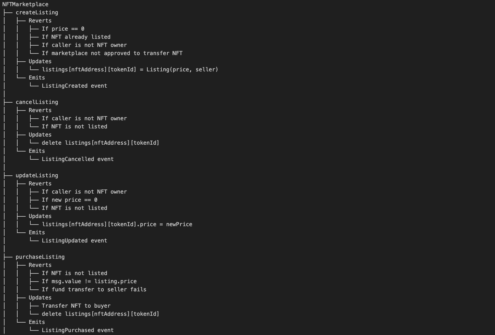
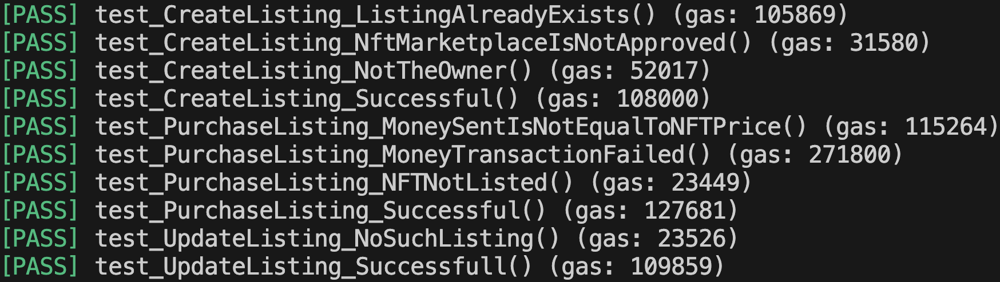
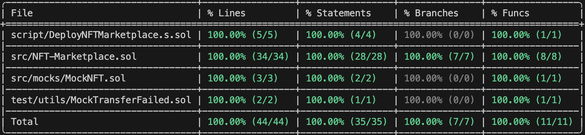

# Celo NFT Marketplace

A decentralized NFT marketplace enabling users to list, update, cancel, and purchase NFTs in a secure and transparent way. This project emphasizes robust smart contract design, comprehensive testing, and efficient gas usage.

---

## Features

- **List NFTs for Sale:** Owners can list their NFTs at a specified price.
- **Update Listings:** Sellers can update the price of their listed NFTs.
- **Cancel Listings:** Sellers can remove their NFTs from the marketplace.
- **Purchase NFTs:** Buyers can purchase listed NFTs securely.
- **Full Test Coverage:** All core functionalities are thoroughly tested.
- **Gas Usage Insights:** Gas consumption for all major operations is measured.

---

## Smart Contract Architecture

The marketplace is implemented in Solidity and follows a modular, test-driven approach. Below is a high-level overview of the contract structure and workflow:

**Core Functions:**

- `createListing`: List an NFT for sale (with checks for ownership, approval, and valid price).
- `cancelListing`: Remove an NFT from the marketplace (only by the owner).
- `updateListing`: Change the price of an existing listing (only by the owner).
- `purchaseListing`: Buy a listed NFT (with payment and transfer validation).

**Modifiers and Events:**

- Modifiers ensure only valid actions (e.g., only the owner can update or cancel a listing).
- Events are emitted for all key actions, enabling easy integration with frontends or subgraphs.

---

## Gas Usage Snapshot

The project includes detailed gas usage tracking for all major contract interactions, helping developers optimize and understand transaction costs.

**Sample Gas Costs:**

- Cancel Listing: 86,989
- Create Listing (Success): 108,000
- Purchase Listing (Success): 127,681
- Update Listing (Success): 109,859

---

## Test Coverage

Comprehensive tests ensure all functionalities work as intended and edge cases are handled. The project achieves **100% coverage** across all files, statements, branches, and functions.

- All smart contract logic is fully tested.
- Edge cases (invalid prices, unauthorized actions, failed transfers) are covered.
- Mock contracts are used for simulating different scenarios.

---

## Project Structure

- `src/NFT-Marketplace.sol`: Main marketplace contract.
- `src/mocks/MockNFT.sol`: Mock NFT contract for testing.
- `test/`: Contains all unit and integration tests.
- `scripts/`: Deployment scripts.

---

## Contribution

Feel free to open issues or pull requests to suggest improvements, report bugs, or contribute new features.

---

## License

This project is licensed under the MIT License.

---

## Acknowledgements

- Built with Solidity, Foundry, and OpenZeppelin.
- Inspired by NFT marketplace project by [Learnweb3.io](https://learnweb3.io/lessons/build-a-full-stack-nft-marketplace-like-open-sea-from-scratch-using-next-js-hardhat-rainbow-kit-and-celo/)

---

## Resources and References

- [solidity-by-example](https://solidity-by-example.org/)
- [foundry fundamentals by cyfrin updraft](https://updraft.cyfrin.io/courses/foundry)
- [foundry book](https://getfoundry.sh/introduction/getting-started)
- [ERC721 functions](https://docs.openzeppelin.com/contracts/3.x/api/token/erc721)
- [nft-marketplace project by allwin199](https://github.com/allwin199/nft-marketplace)

---

**Note:** This project is for educational and demonstration purposes. Do not use in production without a full security audit.

⁂

